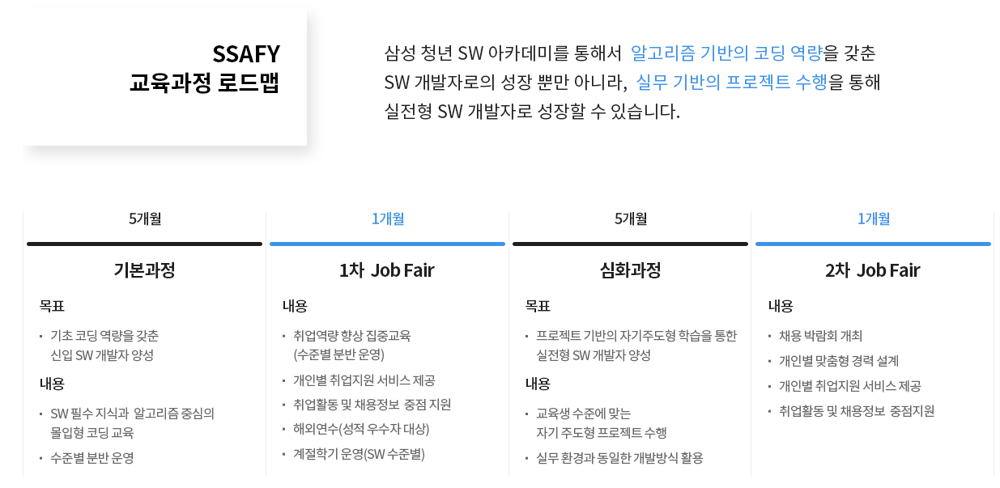
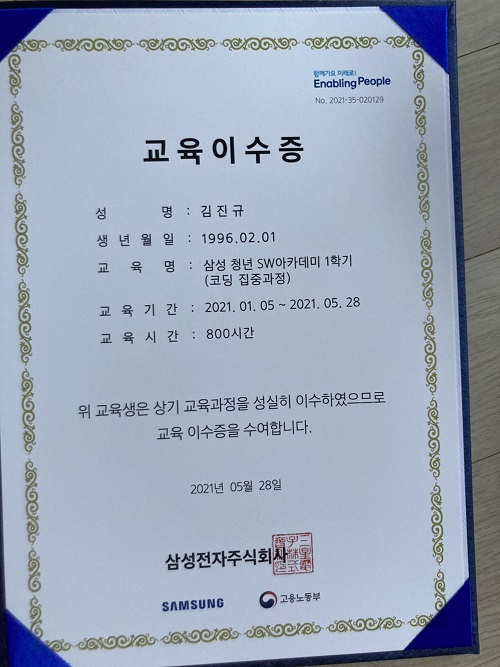
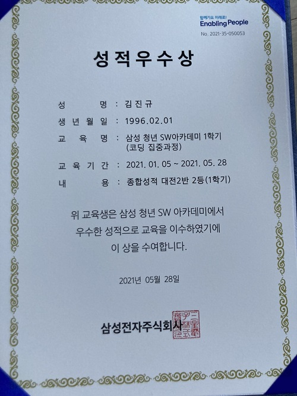

# SSAFY 

> 삼성 SW 아카데미
> Samsung Software Academy For Youth

## 교육 소개

- SSAFY에 대한 보다 자세한 소개는 [SSAFY 홈페이지](https://www.ssafy.com/ksp/jsp/swp/swpMain.jsp)에서 확인할 수 있습니다.

### 교육기간

- 2021.01.15 ~ 2021.05.28 (1학기)
- 2021.05.29 ~ 2021.07.03 (계절학기)
- 2021.07.04 ~ 

### 교육 이수내역

### 수상 내역

